<h1 align="center">Night Goggles</h1>

  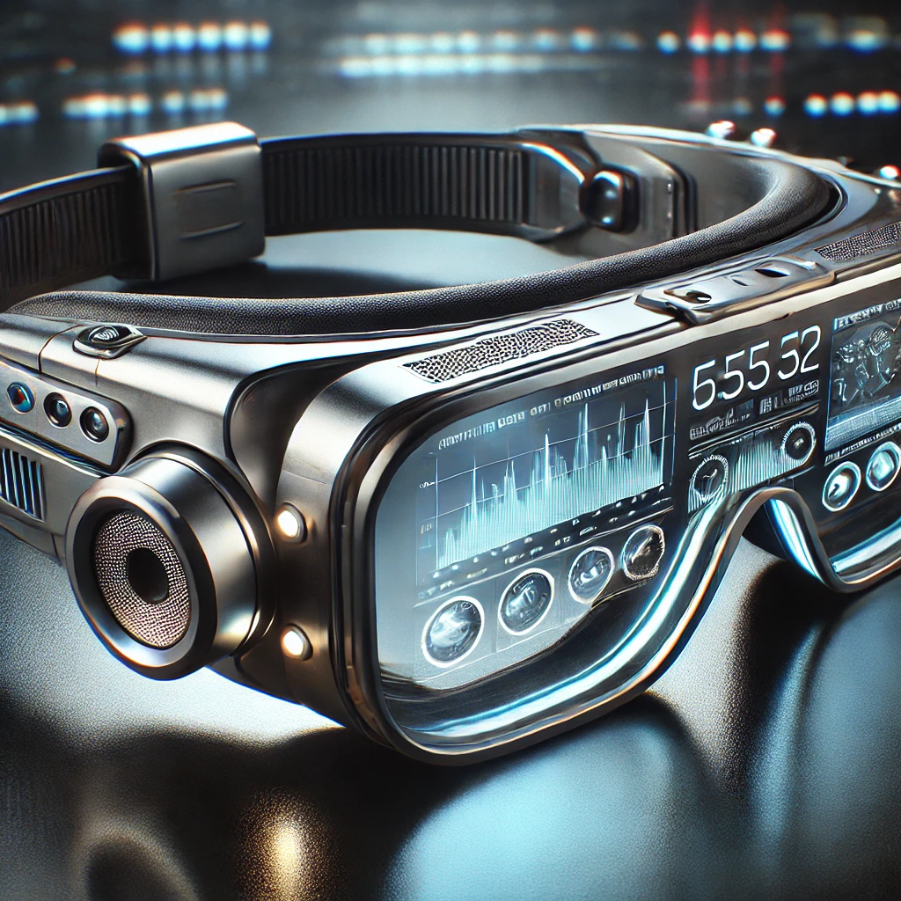

<h2>Overview</h2>

  The Futuristic Smart Goggles project is an innovative wearable tech concept
  designed to merge cutting-edge technology with sleek, modern design. These
  goggles feature a built-in heads-up display (HUD), integrated camera, touch
  controls, and various other high-tech elements, creating a highly interactive
  and immersive experience. This project aims to explore the potential of
  augmented reality (AR), IoT connectivity, and hands-free control in everyday
  life.

<h2>Features</h2>
<ul>
  <li>
    <strong>Heads-Up Display (HUD):</strong> Transparent display embedded in the
    lenses to show real-time information, such as notifications, navigation, or
    data overlays.
  </li>
  <li>
    <strong>Integrated Camera:</strong> A high-definition camera for capturing
    photos, recording video, and enabling live streaming.
  </li>
  <li>
    <strong>Touch-Sensitive Controls:</strong> Touch-enabled arms for adjusting
    settings, scrolling through menus, and interacting with apps.
  </li>
  <li>
    <strong>Orbital Simulation:</strong> Visualize and simulate the motion of
    planets over time.
  </li>
  <li>
    <strong>LED Indicators:</strong> Glowing LED accents on the frame for status
    updates and aesthetic appeal.
  </li>
  <li>
    <strong>Speaker & Microphone:</strong> Small built-in speakers and
    microphone for voice commands, calls, or media playback.
  </li>
  <li>
    <strong>AR Capabilities:</strong> Overlay virtual elements onto the real
    world through the goggles' HUD for navigation, gaming, and more.
  </li>
</ul>

<h2>Future Enhancements</h2>
<ul>
  <li>
    <strong>Gesture Control:</strong> Adding gesture recognition for hands-free
    interaction.
  </li>
  <li>
    <strong>AI-Powered Assistant:</strong> Integrating a voice-activated
    assistant to enhance user experience.
  </li>
  <li>
    <strong>Environmental Sensors:</strong> Equipping the goggles with
    temperature, light, and motion sensors for smart responses to surroundings.
  </li>
</ul>

<h2>Contributing</h2>

  We welcome contributions from the community!. It will be real helpful if this
  small idea becomes a real life gadget, so I will be really glad if u can make
  contributions to this repository.

<h2>License</h2>

  This project is licensed under the <strong>MIT License</strong>. For more
  information, please refer to the <a href="LICENSE">LICENSE</a> file.

<h2>Special Thanks to:</h2>
<ul>
  <li>
    <strong>Karthikeya:</strong>
    

      For his help in developing the 3D model and actively aiding in the fixes
      and refining
       
      Check his GitHub page at:
      <a href="https://github.com/alurubalakarthikeya"> Here </a>
    

  </li>
  <li>
    <strong>Ayush:</strong>
    For his help in aiding in the development of the 3D model and actively
    aiding in the fixes and also solely responisble for the 3D models
    afformented in the Extras folder.
     
    Check his GitHub page at:
    <a href="https://github.com/ayushsingh08-ds">Here</a>
  </li>
</ul>

<h2>Details</h2>

<h3>⦾ Night Goggle Page:-</h3>

  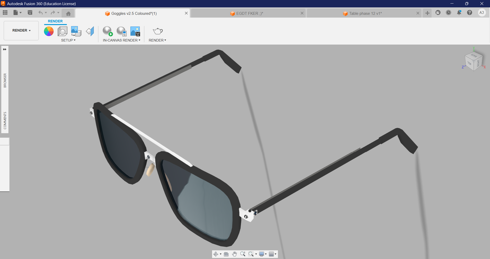

  <strong>Futuristic Smart Goggles</strong>: High-tech wearable goggles
  featuring a transparent heads-up display (HUD), an integrated HD camera,
  touch-sensitive controls, LED indicators, and built-in speakers. Designed for
  immersive augmented reality experiences, hands-free control, and real-time
  data visualization.

<h4>Additional Pictures:-</h4>

  
  
  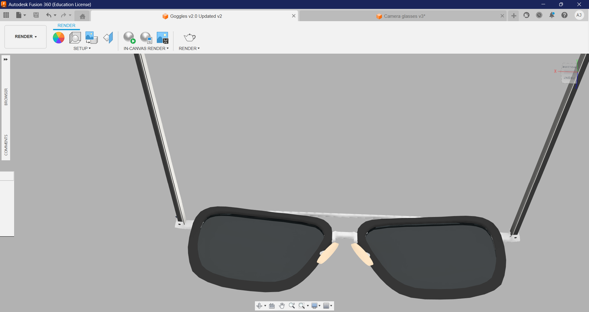
  
  
  
  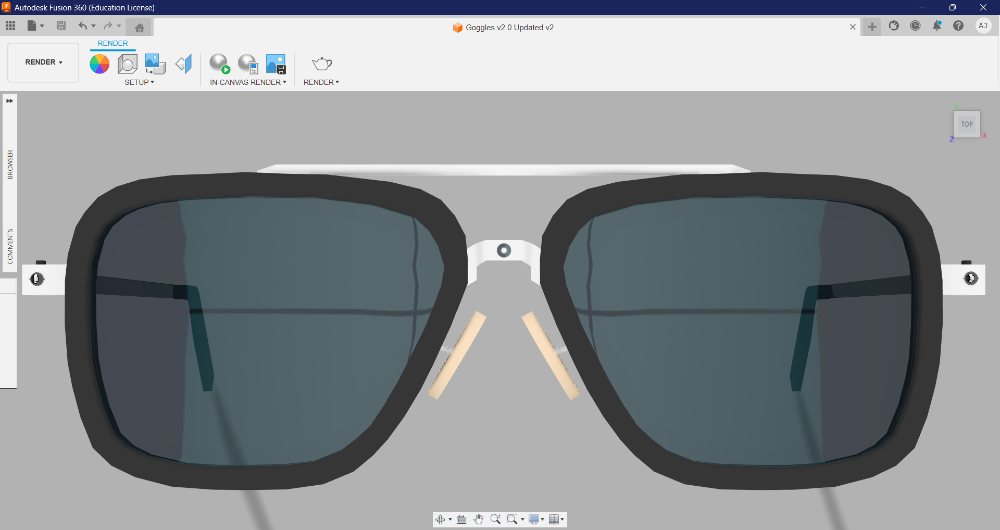
  
  
  
  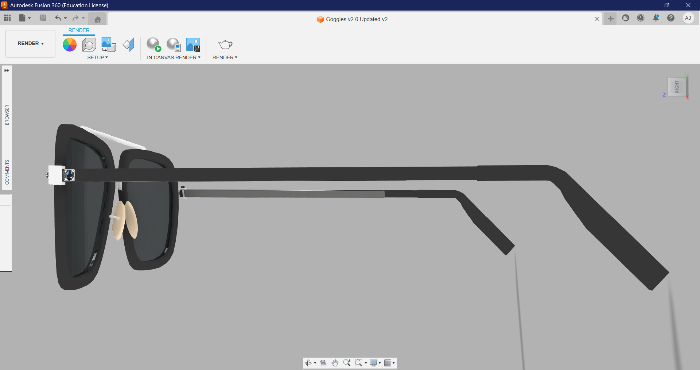
  
  
  
  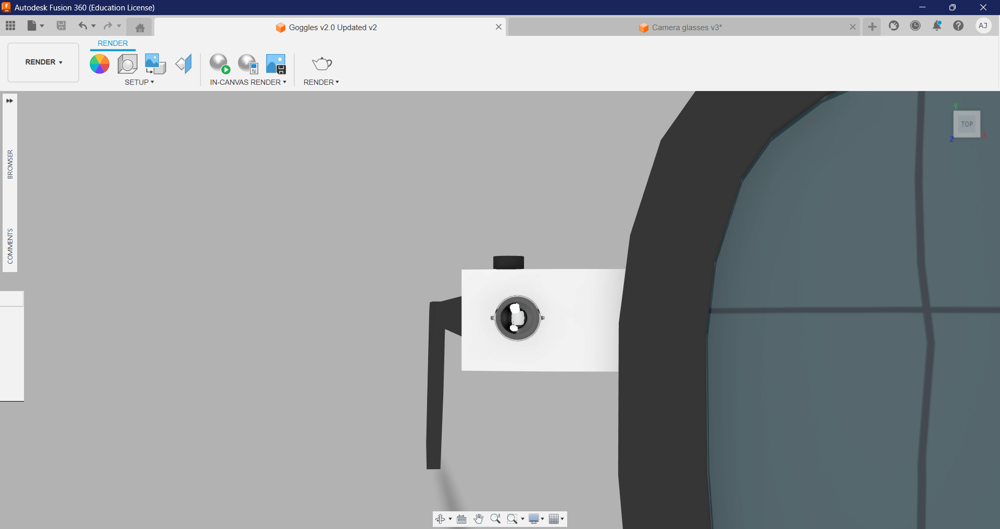
  
  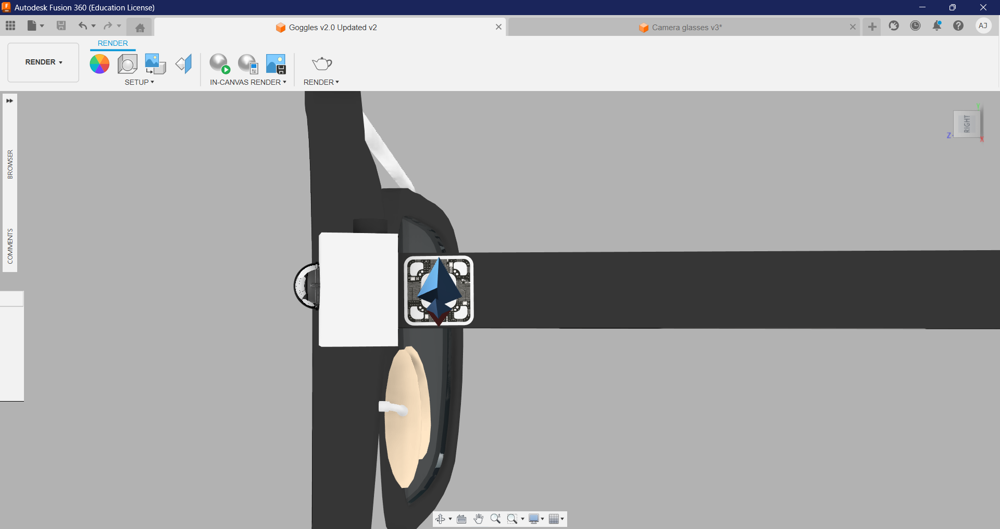
  

<h3>⦾ Chair Page:-</h3>

  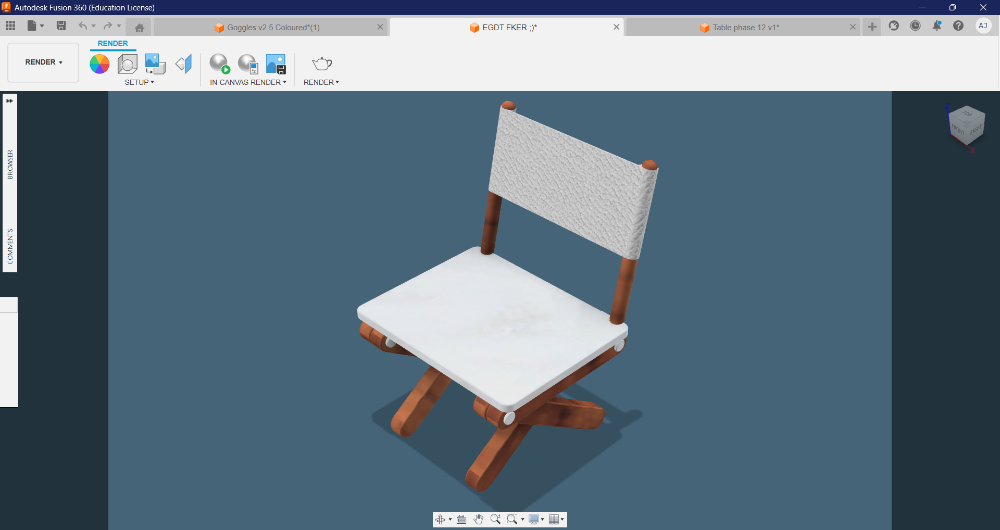

  <strong>Convertible Chair-Table:</strong> A versatile piece of furniture that
  seamlessly transforms from a comfortable chair into a functional table.
  Designed for space-saving convenience, it features a quick-fold mechanism and
  durable materials, offering both style and practicality for small spaces or
  multi-purpose use.

<h4>Additional Pictures:-</h4>

  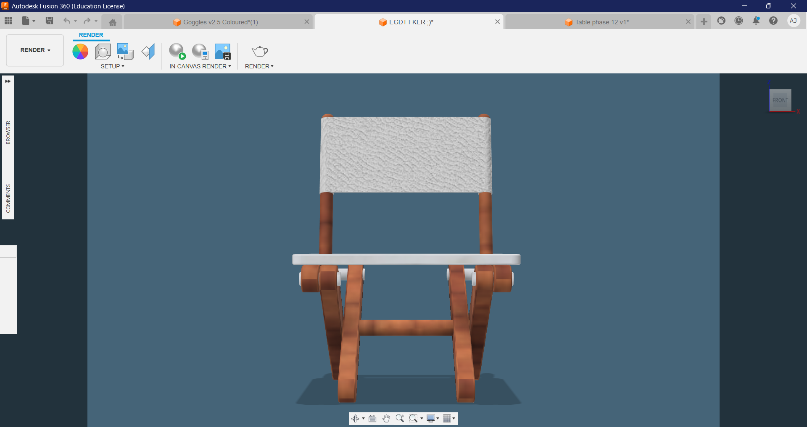
  
  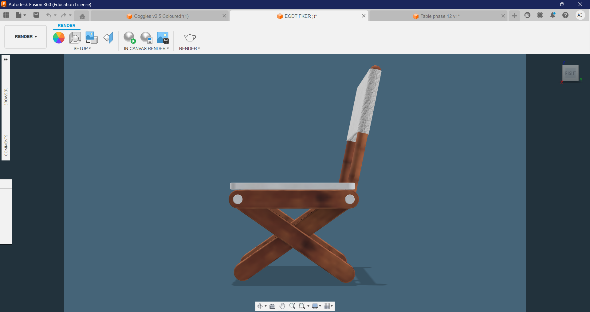
  
  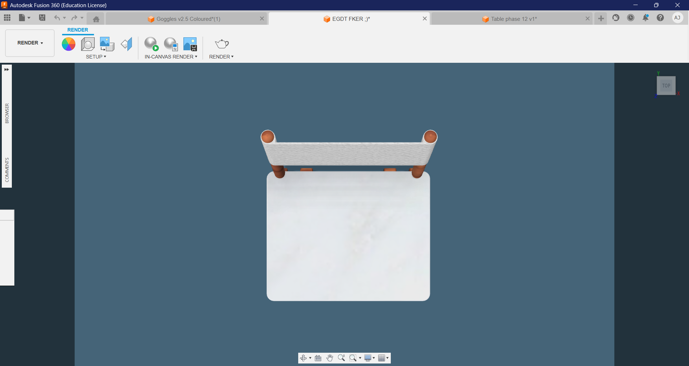
  

<h3>⦾ Table Page:-</h3>

  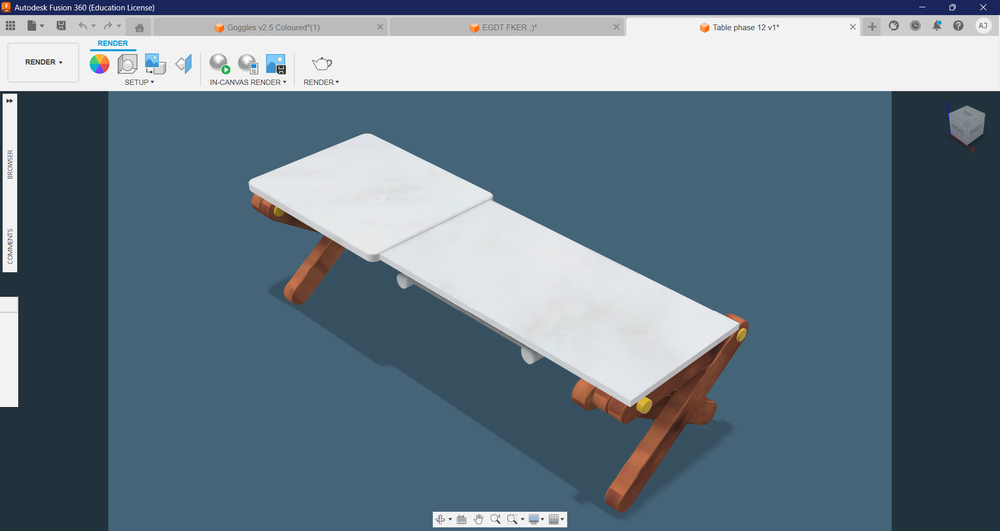

  <strong>Convertible Table-Chair</strong>: A versatile piece of furniture that
  seamlessly transforms from a comfortable table into a functional chair.
  Designed for space-saving convenience, it features a quick-fold mechanism and
  durable materials, offering both style and practicality for small spaces or
  multi-purpose use.

<h4>Additional Pictures:-</h4>

  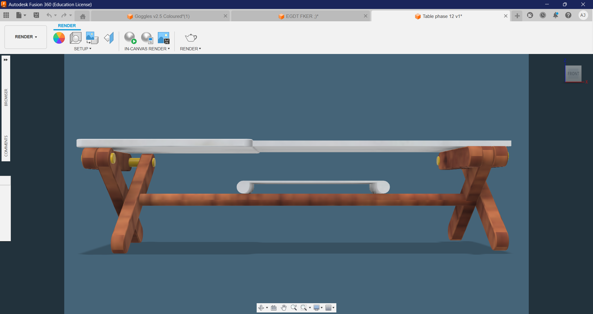
  
  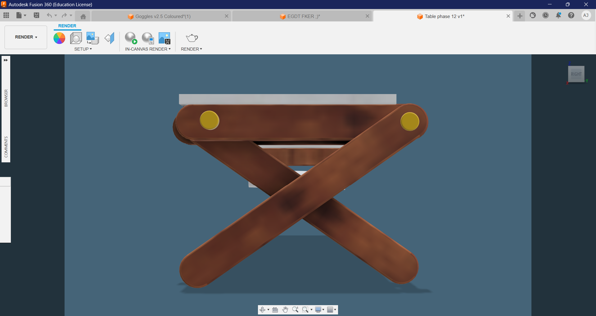
  
  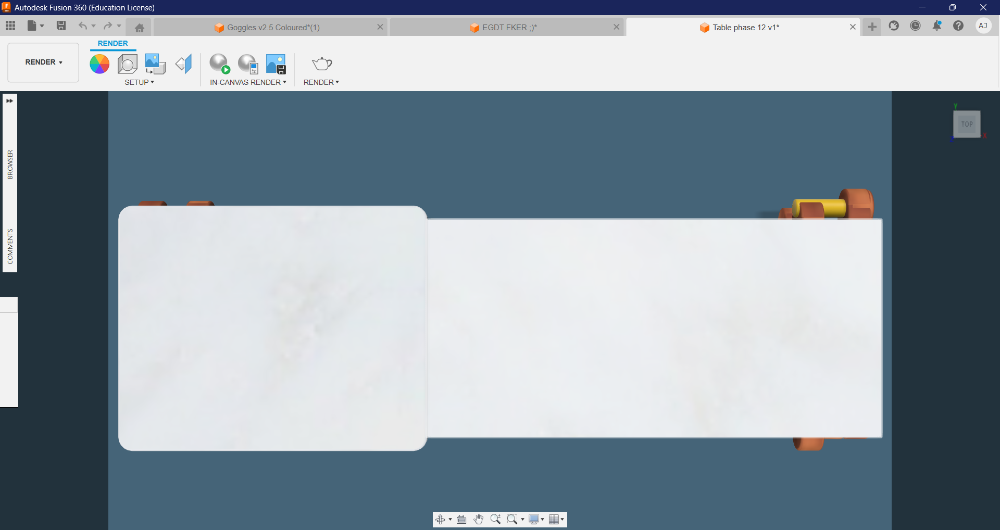
  

<h2>Conclusion</h2>

  The <strong>Futuristic Smart Goggles</strong> project represents a bold step
  into the future of wearable technology, blending style with advanced features
  like augmented reality, integrated cameras, and hands-free controls. This
  innovative design opens up exciting possibilities for real-time data
  interaction, entertainment, and productivity, making it a powerful tool for
  both everyday use and specialized applications. As the project evolves, the
  integration of AI, gesture control, and environmental sensors will further
  enhance its functionality, paving the way for a truly immersive tech
  experience.

  Similarly, the <strong>Convertible Chair-Table </strong>brings versatility and
  practicality to modern living spaces, offering a seamless transition between a
  chair and a table. Its smart design optimizes space without compromising
  comfort or functionality, making it ideal for small homes, offices, or
  multipurpose rooms. The combination of style, convenience, and adaptability
  makes it a standout piece for those seeking innovative furniture solutions.

